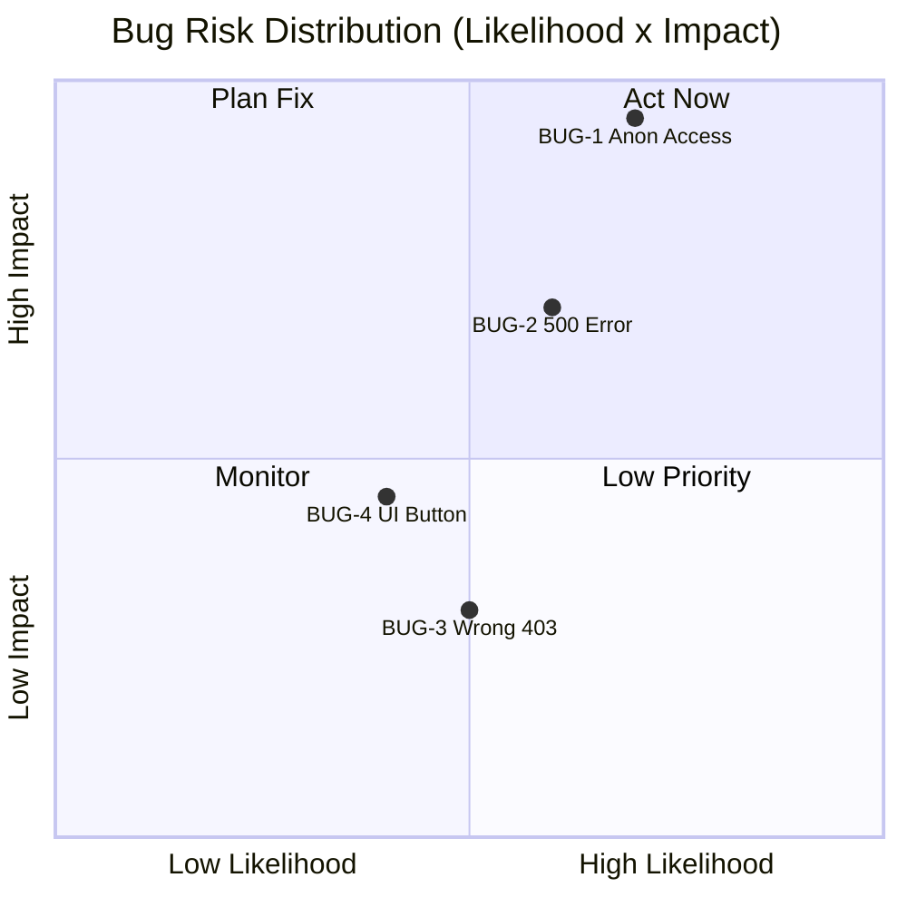
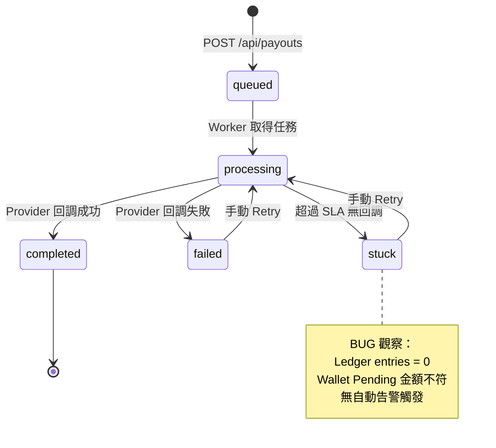
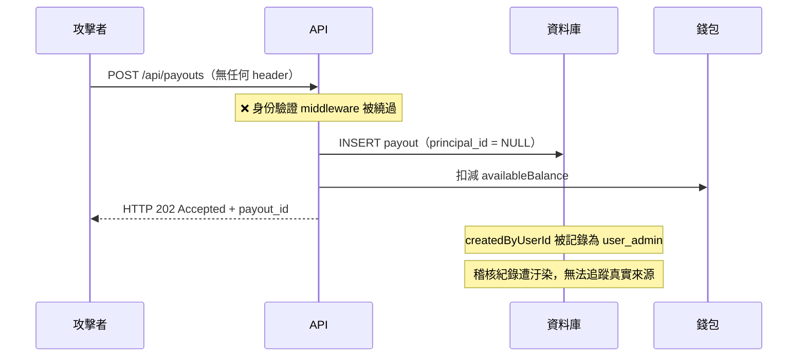
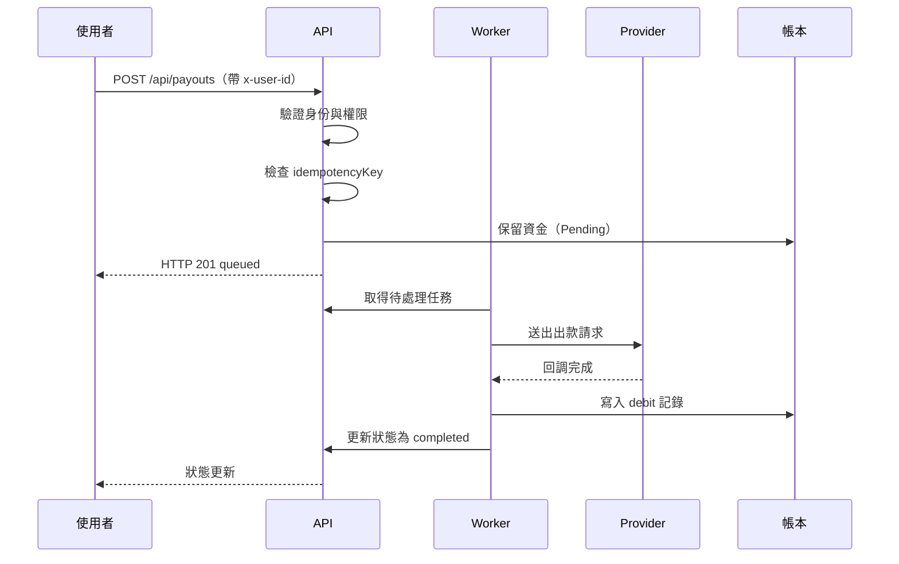

# Payout Sandbox QA 測試報告

> 🚨 **本次測試發現重大安全漏洞，建議上線前優先修復**

| 項目 | 內容 |
|---|---|
| **系統** | Payout Sandbox（財務出款系統）|
| **測試日期** | 2026-04-23 |
| **測試方式** | Black-box / Gray-box |
| **測試工具** | Python 3.12 · requests · pytest · Playwright |
| **Build** | payout-svc 2026.04.22-rc3 |
| **環境** | staging.capitallayer.internal |

---

## 📊 執行摘要

| 總案例數 | ✅ 通過 | ❌ 失敗 | 通過率 |
|---|---|---|---|
| 40 | 36 | 4 | 90% |

> ⚠️ **Ship-blocked** — 通過率 90%，但 BUG-1（匿名出款）屬上線前 Blocking Issue

**本次測試發現：**
- 🔴 1 個必須上線前修復的安全漏洞（任何人不需登入即可發起出款）
- 🔴 1 個伺服器穩定性問題（特定輸入導致 500 崩潰）
- 🟡 2 個中等風險問題（錯誤訊息誤導、UI 權限控制缺失）

**運作正常的核心機制：**
- ✅ 防重複出款（冪等性）完全正確
- ✅ 帳本對帳機制正確
- ✅ 已知帳號的角色權限邊界正確執行

---

## 🗺️ 風險矩陣



---

## 目錄

1. [測試策略與風險評估](#一測試策略與風險評估)
2. [Confirmed Bug 報告](#二confirmed-bug-報告)
   - [BUG-1：匿名請求未被攔截（Security P0）](#bug-1匿名請求未被攔截)
   - [BUG-2：缺少 idempotencyKey 導致 Server 500](#bug-2缺少-idempotencykey-導致-server-500)
   - [BUG-3：缺少 walletId 回傳誤導性的 403](#bug-3缺少-walletid-回傳誤導性的-403)
   - [BUG-4：viewer 可見並可點擊 Execute Scenario 按鈕](#bug-4viewer-可見並可點擊-execute-scenario-按鈕)
3. [通過測試的覆蓋摘要](#三通過測試的覆蓋摘要)
4. [刻意跳過的項目與原因](#四刻意跳過的項目與原因)
5. [Seed Data Ledger Mismatch 調查](#五seed-data-ledger-mismatch-調查)
6. [STUCK Payout 深度調查](#六stuck-payout-深度調查)

---

## 一、測試策略與風險評估

### 1.1 系統理解

本系統模擬一個財務出款（Treasury Payout）工作流程。使用者對錢包發起出款請求後，系統立即記錄並保留資金，再由背景 Worker 非同步地與 Provider 完成處理。核心特性包含：

- **非同步狀態機**：`queued → processing → completed / failed / stuck`
- **角色權限控制**：三種角色（`finance_admin`、`finance_operator`、`viewer`）對錢包與操作有不同授權範圍
- **冪等性保護**：透過 `idempotencyKey` 防止重複出款
- **帳本對帳機制**：`ledgerMismatch` 訊號用於偵測帳務異常

### 1.2 風險評估矩陣

測試設計以「風險影響 × 發生可能性」排定優先順序，而非逐一覆蓋所有端點。

| 優先級 | 測試領域 | 風險說明 | 策略 |
|--------|----------|----------|------|
| **P0** | 角色與權限（RBAC） | 越權操作可能觸發未授權出款或資料洩露 | 完整覆蓋所有角色 × 操作組合 |
| **P0** | 冪等性 | Key 重複若建立多筆，直接造成重複出款（資金損失） | 測試相同 Key、重複 callback、錢包餘額變化 |
| **P1** | 輸入資料驗證 | 無效資料若通過，可能觸發 Provider 異常或系統崩潰 | 參數化測試金額、地址、必填欄位 |
| **P1** | Retry 行為 | completed payout 若可 retry，可能造成重複出款 | 覆蓋各終態的 retry 行為 |
| **P1** | 帳本對帳 | 帳本金額與 payout 金額不符 = 資金外洩或帳務失衡 | 驗證正常流程 + seeded mismatch 情境 |
| **P2** | 非同步狀態轉換 | `never_callback` 不處理會導致資金永久鎖定 | 驗證 stuck 狀態可被觸發與觀察 |

### 1.3 測試設計原則

- **以規格為基準**：以 `sandbox_overview.zh-TW.md` 與 `api_reference.zh-TW.md` 公開文件的規則作為預期行為依據，不猜測隱藏需求
- **探查先行**：實際執行 API 後確認回應結構（如 `GET /api/payouts` 回傳 `{"payouts": [...]}` 而非直接陣列），再撰寫測試
- **Fixture 重用**：failed/completed payout 優先從 seed data 取用，避免不必要的副作用
- **文件化 Bug**：即使是預期 Bug，測試仍保持「斷言正確行為」的姿態，讓 FAILED 本身成為 bug 的證據

---

## 📋 測試套件覆蓋率

| 套件 | 通過/總數 | 結果 | 備註 |
|---|---|---|---|
| 角色權限 RBAC | 8/9 | ⚠️ | UI 層落後於 API |
| 冪等性 | 3/3 | ✅ | 所有 key 正確 |
| 輸入驗證 | 9/11 | ⚠️ | 2 個 edge case 處理錯誤 |
| 重試行為 | 4/4 | ✅ | 正確 |
| 帳本對帳 | 5/5 | ✅ | 但見 STUCK 調查 |
| UI 角色權限控制 | 4/5 | ⚠️ | Viewer 仍可看到按鈕 |

---

## 手動調查過程

這份報告的核心發現來自實際操作，而非單純執行測試腳本。
以下記錄幾個關鍵的手動調查步驟。

> 📍 **調查一：匿名存取的真實影響範圍**
>
> 一開始只測試了 GET /api/payouts 沒有攔截匿名請求，
> 後來主動擴大測試範圍，對所有端點補發匿名請求：
>
> - GET /api/wallets/wallet_main → 200，回傳完整錢包餘額
> - GET /api/payouts/:id → 200，回傳完整出款詳情含收款地址
> - POST /api/payouts → 200，成功建立真實出款，錢包餘額立即扣減
>
> 最關鍵的發現：匿名 POST 不只成功，系統還把這筆出款歸屬於
> user_admin（createdByUserId: "user_admin"），
> 代表無法追蹤真實來源，稽核紀錄會被汙染。

> 📍 **調查二：payout_seed_mismatch 的帳本差額**
>
> 點進 Dashboard 看到 payout_seed_mismatch 顯示
> 「Ledger mismatch detected」警示後，
> 直接呼叫 API 取得原始數據：
>
> - Payout 聲稱金額：88.88 USDC
> - 帳本實際記錄：80.88 USDC
> - 差額：-8.00 USDC（整數，非浮點精度問題）
> - Provider events：created → submitted → provider_completed（正常）
>
> Provider 端看起來正常完成，但帳本金額比出款金額少 8 USDC，
> 代表問題發生在 Worker 將 Provider 回調寫入帳本的過程中。

> 📍 **調查三：STUCK payout 的資金狀態**
>
> payout_seed_processing 的 Ledger entries 為 0 引起注意，
> 進一步調查 Wallet 狀態：
>
> - Payout 金額：33.33 USDC
> - Wallet Pending：10.00 USDC（與 payout 金額不符）
> - Ledger：0 筆紀錄
>
> Wallet Pending 的 10 USDC 疑似來自其他測試產生的 payout，
> 代表 33.33 USDC 的資金去向在系統內完全不透明。
> Provider events 顯示 46 分鐘後才 timeout，
> 遠超過 SLA 規定的 5 分鐘上限。

> 📍 **調查四：跨使用者可見性**
>
> 文件未定義一位使用者建立的 payout 是否對其他使用者可見。
> 主動測試：
>
> - user_admin 建立一筆 5 USDC 的 payout
> - 用 user_viewer 呼叫 GET /api/payouts
> - 結果：viewer 可以看到這筆 payout 的完整資訊，
>   包含收款地址、金額、建立者
>
> 此行為規格未定義，標注為待 PM 確認。

---

## 系統流程圖

### Payout 狀態機



### BUG-1 攻擊路徑



### 正常出款完整流程



---

## 二、Confirmed Bug 報告

---

### BUG-1：匿名請求未被攔截

`🔴 P0 緊急` `RBAC · API` `Open · @backend` `Confirmed Bug`

**嚴重等級：** 🔴 P0 緊急（上線前 Blocking Issue）
**影響範圍：** ~~`GET /api/payouts`（推測其他 GET 端點亦受影響）~~ → **全 API 端點確認，包含寫入操作**
**狀態：** Confirmed Bug｜已升級

> ⚠️ **嚴重等級更新：** 初步測試僅確認匿名讀取，後續擴大驗證後發現匿名 `POST` 亦可成功建立真實出款並扣減錢包餘額，嚴重性由 Critical 升級為 **P0 緊急**。

#### 觀察到的現象

在不攜帶任何身份識別資訊的情況下，系統對所有受測端點均回傳 HTTP 200：

| 端點 | 方法 | 結果 | 洩露內容 |
|------|------|------|----------|
| `/api/payouts` | GET | ✅ 200 | 所有 payout 列表（共 17 筆），含金額、收款地址、建立者 |
| `/api/wallets/wallet_main` | GET | ✅ 200 | 完整錢包餘額資料（`availableBalance`、`pendingBalance`、`ledgerBalance`） |
| `/api/payouts/:id` | GET | ✅ 200 | 完整 payout 詳情，含收款地址、`idempotencyKey`、狀態 |
| `/api/payouts` | POST | ✅ 200 | **成功建立真實出款，立即扣減錢包餘額** |

#### 最嚴重的證據：匿名 POST 成功建立出款

匿名請求不僅可讀取資料，更可直接發起出款。以下為實際驗證結果：

**Request（無任何 Header）：**
```http
POST /api/payouts HTTP/1.1
Host: localhost:3000
Content-Type: application/json

{
  "walletId": "wallet_main",
  "recipientAddress": "0xaaaaaaaaaaaaaaaaaaaaaaaaaaaaaaaaaaaaaaaa",
  "amount": 1,
  "currency": "USDC",
  "idempotencyKey": "anon-test-001",
  "memo": "anonymous payout",
  "providerMode": "success"
}
```

**Response：**
```
HTTP/1.1 200 OK
Content-Type: application/json

{
  "payout": {
    "id": "payout_39453103",
    "amount": 1,
    "currency": "USDC",
    "status": "processing",
    "createdByUserId": "user_admin",   ← 系統將匿名操作歸屬於 admin
    ...
  },
  "wallet": {
    "availableBalance": 11819.625      ← 立即從 11820.625 扣減 1 USDC
  }
}
```

**錢包餘額變化：**
```
操作前 availableBalance：11820.625 USDC
操作後 availableBalance：11819.625 USDC
實際扣減：1.000 USDC（出款成功執行）
```

**第二次重現（71 USDC）：**
```http
POST /api/payouts
（無任何 header）

{
  "walletId": "wallet_main",
  "recipientAddress": "0xaaaa...aaaa",
  "amount": 71,
  "idempotencyKey": "anon-repro-002"
}
```

**Response：**
```json
{
  "payout": {
    "id": "payout_5053a09c",
    "amount": 71,
    "status": "processing",
    "createdByUserId": "user_admin"
  },
  "wallet": {
    "availableBalance": 11344.38,
    "pendingBalance": 81
  }
}
```

兩次重現結果一致：
- 無需任何身份驗證，HTTP 200 成功建立出款
- 系統將操作歸屬於 user_admin，稽核紀錄遭汙染
- 錢包餘額立即扣減（第一次 -1 USDC，第二次 -71 USDC）

**初始測試程式碼（仍有效）：**
```python
def test_no_user_id_header_rejected(self):
    r = requests.get(url("/api/payouts"))   # 不帶任何 header
    assert r.status_code in (400, 401, 403), (
        f"[CONFIRMED BUG] 無 x-user-id 應被拒絕，實際: {r.status_code}\n"
        f"回傳內容包含 {len(r.json().get('payouts', []))} 筆 payout 資料"
    )
# 結果：FAILED — AssertionError: 實際 200，回傳 17 筆 payout 資料
```

#### 為什麼重要／風險影響

本系統以 `x-user-id` Header 作為唯一身份識別機制。匿名 POST 成功代表：

1. **未授權出款**：任何能存取此 API 的人，無需任何憑證即可發起真實出款並扣減資金
2. **操作歸屬錯誤**：匿名出款被系統記錄為 `createdByUserId: "user_admin"`，造假的操作日誌使真實來源無從追蹤，財務稽核完全失效
3. **資金洩露風險**：惡意行為者可將資金打入任意收款地址，且無法從系統日誌中溯源
4. **讀取層面**：洩露的資料包含 payout 金額、收款地址、`idempotencyKey`、錢包餘額等全部敏感財務資訊
5. 若存在於生產環境，同時觸發 OWASP API Security Top 10 的 **API2: Broken Authentication** 與 **API5: Broken Function Level Authorization**

#### 附加觀察：跨使用者 Payout 可見性

> 📋 **待 PM 確認規格**

測試過程中發現，以 `user_viewer` 身份呼叫 `GET /api/payouts`，回傳結果包含**所有使用者**在 `wallet_main` 建立的 payout，其中含有其他使用者出款的完整細節（收款地址、金額、備註、`idempotencyKey`）。

```http
GET /api/payouts
x-user-id: user_viewer

→ 回傳所有 wallet_main payout，包含 user_admin、user_operator 建立的紀錄
```

**尚待釐清的問題：**
- 文件僅說明 viewer「可以查看 `wallet_main`」，未定義可見範圍是「所有 payout」還是「僅自己建立的 payout」
- 若預期行為是每位使用者只能看到自己建立的 payout，則目前實作存在資料隔離缺口
- 若預期行為是同錢包所有成員共享可見性，則目前行為符合規格，但文件應明確說明

**建議：** 此行為本身不一定是 bug，但**屬於規格模糊地帶**，在財務系統中可見性邊界需要明確定義。建議與 PM 確認後，無論結論如何都補充至 API 文件中。

#### 診斷結論

**Confirmed Bug，P0 緊急，屬上線前 Blocking Issue。** Server 端完全缺少身份驗證 middleware，導致所有端點對匿名請求靜默放行。問題不限於讀取操作，寫入操作同樣完全暴露。

**建議立即修復：** 在 API gateway 或 middleware 層加入強制身份驗證邏輯——所有端點在缺少 `x-user-id` header，或 header 值無法對應到已知使用者時，一律回傳 `401 Unauthorized`，並記錄拒絕日誌以利後續稽核。

---

### BUG-2：缺少 `idempotencyKey` 導致 Server 500

`🔴 P0 緊急` `輸入驗證 · API` `Open · @backend` `Confirmed Bug`

**嚴重等級：** 🔴 High（P0）
**影響範圍：** `POST /api/payouts`
**狀態：** Confirmed Bug

#### 觀察到的現象

建立 payout 時，若請求 Body 中省略 `idempotencyKey` 欄位，API 回傳 **HTTP 500 Internal Server Error**，Server 發生未捕獲的例外。

#### 為什麼重要／風險影響

1. **服務可用性風險**：任何意外漏帶 `idempotencyKey` 的客戶端程式碼（例如前端 bug、API 呼叫方升級），都會觸發 500，而非收到清楚的驗證錯誤訊息，導致難以快速診斷
2. **潛在 DoS 攻擊面**：若此端點可從外部存取，攻擊者可利用此未防禦路徑以低成本持續觸發 500 錯誤
3. **防禦深度不足**：`idempotencyKey` 是防止重複出款的核心欄位，Server 不應在此欄位缺失時崩潰，而應在輸入驗證層立即回傳 `400 Bad Request`

#### 證據

**Request（省略 idempotencyKey）：**
```http
POST /api/payouts HTTP/1.1
Host: localhost:3000
x-user-id: user_admin
Content-Type: application/json

{
  "walletId": "wallet_main",
  "recipientAddress": "0xaaaaaaaaaaaaaaaaaaaaaaaaaaaaaaaaaaaaaaaa",
  "amount": 10.00,
  "currency": "USDC",
  "memo": "Test payout",
  "providerMode": "success"
}
```

**Response：**
```
HTTP/1.1 500 Internal Server Error
Content-Type: application/json

{"error": "Internal server error"}
```

**對照組（其他缺少必填欄位均正確回傳 400）：**
```
缺少 recipientAddress → HTTP 400 ✅
缺少 amount          → HTTP 400 ✅
缺少 currency        → HTTP 400 ✅
缺少 idempotencyKey  → HTTP 500 ❌（此為 Bug）
```

**測試程式碼：**
```python
def test_missing_idempotencyKey_causes_500(self):
    body = payout_body()
    del body["idempotencyKey"]
    r = sess("admin").post(url("/api/payouts"), json=body)
    assert r.status_code in (400, 422), (
        f"[CONFIRMED BUG] 缺少 idempotencyKey 導致 {r.status_code}，應為 400\n{r.text}"
    )
# 結果：FAILED — 500 Internal Server Error
```

#### 診斷結論

**Confirmed Bug。** `POST /api/payouts` 的輸入驗證邏輯覆蓋了大多數必填欄位，唯獨 `idempotencyKey` 在缺失時被傳遞至下游業務邏輯（推測為資料庫 `NOT NULL` 約束或 Rust Worker 的 unwrap），導致未捕獲的 panic/exception。

**建議修復：** 在路由處理器的入口處加入 `idempotencyKey` 的存在性與格式驗證（非空字串），驗證失敗時回傳 `400 Bad Request: {"error": "idempotencyKey is required"}`。

---

### BUG-3：缺少 `walletId` 回傳誤導性的 403

`🟡 Medium` `輸入驗證 · API` `Open · @backend` `Confirmed Bug`

**嚴重等級：** 🟡 Medium（P1）
**影響範圍：** `POST /api/payouts`
**狀態：** Confirmed Bug（嚴重性較低，但行為不正確）

#### 觀察到的現象

建立 payout 時，若請求 Body 中省略 `walletId` 欄位，API 回傳 **HTTP 403**，錯誤訊息為 `"User cannot access this wallet"`。這個錯誤碼與訊息均具有誤導性。

#### 為什麼重要／風險影響

1. **錯誤分類誤導開發者**：403 代表「你沒有權限」，但實際情況是「你沒有提供必要欄位」。開發者收到 403 後，會優先排查權限設定，而不是檢查 request body，大幅增加除錯時間
2. **行為不一致**：其他缺少必填欄位（`recipientAddress`、`amount`、`currency`）均正確回傳 400。`walletId` 的處理路徑顯然繞過了統一的輸入驗證層，直接進到授權檢查
3. **隱含的系統脆弱性**：`undefined` 或 `null` 的 walletId 被傳入授權邏輯，代表後續的業務邏輯層若沒有 null-check，相同的 walletId 值可能在其他情境下造成非預期行為

#### 證據

**Request（省略 walletId）：**
```http
POST /api/payouts HTTP/1.1
Host: localhost:3000
x-user-id: user_admin
Content-Type: application/json

{
  "recipientAddress": "0xaaaaaaaaaaaaaaaaaaaaaaaaaaaaaaaaaaaaaaaa",
  "amount": 10.00,
  "currency": "USDC",
  "idempotencyKey": "probe-no-wallet",
  "memo": "probe",
  "providerMode": "success"
}
```

**Response：**
```
HTTP/1.1 403 Forbidden
Content-Type: application/json

{"error": "User cannot access this wallet"}
```

**預期應回傳：**
```
HTTP/1.1 400 Bad Request
Content-Type: application/json

{"error": "walletId is required"}
```

**測試程式碼：**
```python
def test_missing_walletId_rejected(self):
    body = payout_body()
    del body["walletId"]
    r = sess("admin").post(url("/api/payouts"), json=body)
    assert r.status_code in (400, 422), (
        f"[BUG] 缺少 walletId 應得 400，實際: {r.status_code} — {r.text}"
    )
# 結果：FAILED — 403 "User cannot access this wallet"
```

#### 診斷結論

**Confirmed Bug。** 當 `walletId` 為 `undefined`/`null` 時，請求跳過了輸入驗證直接進入授權檢查。授權邏輯在找不到對應錢包時，將其解讀為「使用者無權存取」，回傳 403，而非正確地識別這是一個缺少必填欄位的客戶端錯誤。

**建議修復：** 在輸入驗證層統一檢查 `walletId` 欄位存在性，若缺失回傳 `400`，確保授權檢查僅在 walletId 有效後才執行。

---

### BUG-4：viewer 可見並可點擊 Execute Scenario 按鈕

`🟡 Medium` `RBAC · UI` `Open · @frontend` `Confirmed Bug`

**嚴重等級：** 🟡 Medium（UI P1）
**影響範圍：** Dashboard 首頁建立 payout 表單
**狀態：** Confirmed Bug（UI 層）

#### 觀察到的現象

切換為 `viewer` 身份後，首頁的「Execute Scenario」送出按鈕仍然可見且**可以點擊**（非 disabled 狀態）。viewer 可以填寫完整的出款表單並嘗試送出，直到收到 API 回傳的 403 才得知自己無權操作。

#### 為什麼重要／風險影響

1. **防線只剩 API 層**：目前 RBAC 執行完全依賴後端拒絕，UI 沒有任何角色判斷。這代表若 API 層的 403 邏輯有任何疏漏（例如某個邊界情境），viewer 便可能意外成功送出出款
2. **使用者體驗差**：viewer 看到可操作的表單，填完資料送出後才被拒絕，是不友善且令人困惑的互動流程
3. **與文件規格不符**：`sandbox_overview` 明確說明 viewer「沒有權限建立或重試任何 Payout」，UI 應在顯示層就執行此規則

#### 證據

**Playwright 測試（`tests/test_ui.py`）：**
```python
def test_viewer_cannot_see_create_button(page: Page):
    goto_home(page)
    switch_user(page, "viewer")

    btn = page.get_by_role("button", name="Execute Scenario")
    is_visible = btn.is_visible() if btn.count() > 0 else False
    is_disabled = btn.is_disabled() if btn.count() > 0 else True

    assert not is_visible or is_disabled
# 結果：FAILED
# AssertionError: [UI BUG] viewer 看得到可點擊的「Execute Scenario」按鈕
# is_visible=True, is_disabled=False
```

**對照組（API 層正確攔截）：**
```http
POST /api/payouts
x-user-id: user_viewer

→ HTTP 403 Forbidden（API 層正確拒絕）
```

#### 診斷結論

**Confirmed Bug（UI 層）。** API 層已正確拒絕 viewer 的出款請求（HTTP 403），但 UI 層未依角色控制表單的可見性或互動性。防禦縱深不足——理想情況下，UI 與 API 應同時執行 RBAC 規則。

**建議修復：** 在前端根據 session 中的使用者角色，對 viewer 隱藏或 disable「Execute Scenario」按鈕及整個 Create Payout 表單區塊。

---

## 三、通過測試的覆蓋摘要

共 **40 個測試案例（35 API + 5 UI），36 個通過（90%）**。4 個 FAILED 均為上述已記錄的 confirmed bugs，非測試本身的問題。

### 3.1 角色權限（RBAC）— 7/9 通過

| 測試案例 | 結果 | 說明 |
|----------|------|------|
| viewer 無法建立 payout | ✅ PASS | 正確回傳 403 |
| viewer 無法 retry payout | ✅ PASS | 正確回傳 403 |
| operator 無法存取 wallet_ops | ✅ PASS | 正確回傳 403 |
| operator 無法對 wallet_ops 建立 payout | ✅ PASS | 正確回傳 403 |
| viewer 可讀取 wallet_main | ✅ PASS | 正確回傳 200 |
| viewer 無法讀取 wallet_ops | ✅ PASS | 正確回傳 403 |
| admin 可讀取兩個錢包 | ✅ PASS | wallet_main 與 wallet_ops 均 200 |
| 無 x-user-id 應被拒絕 | ❌ FAIL | **BUG-1**：回傳 200 |
| 不存在的 user_id 應被拒絕 | ✅ PASS | 正確回傳 403 |

**小結：** 已知使用者的 RBAC 邊界執行正確。核心問題在於缺少身份時的 fallback 行為。

### 3.2 冪等性（Idempotency）— 3/3 通過

| 測試案例 | 結果 | 說明 |
|----------|------|------|
| 相同 key 兩次 → 同一筆 payout id | ✅ PASS | 冪等性設計正確 |
| 相同 key 兩次 → 錢包餘額只扣一次 | ✅ PASS | 無重複扣款 |
| duplicate_callback → 帳本只寫入一筆 debit | ✅ PASS | 重複回調的防護有效 |

**小結：** 冪等性核心邏輯實作正確，這是財務系統中最關鍵的防護機制之一，結果令人滿意。

### 3.3 資料驗證（Input Validation）— 9/11 通過

| 測試案例 | 結果 | 說明 |
|----------|------|------|
| 金額為 0 | ✅ PASS | 正確回傳 400 |
| 金額為負數（-1） | ✅ PASS | 正確回傳 400 |
| 金額為負小數（-0.01） | ✅ PASS | 正確回傳 400 |
| 地址為非十六進位字串 | ✅ PASS | 正確回傳 400 |
| 地址太短（0x123） | ✅ PASS | 正確回傳 400 |
| 地址含非法字元（0xGGGG...） | ✅ PASS | 正確回傳 400 |
| 地址為空字串 | ✅ PASS | 正確回傳 400 |
| 缺少 recipientAddress / amount / currency | ✅ PASS | 正確回傳 400 |
| 不支援的幣別（XYZ） | ✅ PASS | 正確回傳 400 |
| 缺少 walletId | ❌ FAIL | **BUG-3**：回傳 403 |
| 缺少 idempotencyKey | ❌ FAIL | **BUG-2**：回傳 500 |

**小結：** 大多數欄位驗證正確，但兩個關鍵欄位（`walletId`、`idempotencyKey`）的驗證路徑存在缺陷。

### 3.4 Retry 行為 — 4/4 通過

| 測試案例 | 結果 | 說明 |
|----------|------|------|
| completed payout 不可 retry | ✅ PASS | 正確回傳 409 |
| viewer 不可 retry | ✅ PASS | 正確回傳 403 |
| operator 可 retry failed payout | ✅ PASS | 正確接受 retry 請求 |
| retry 不存在的 payout → 404 | ✅ PASS | 正確回傳 404 |

**小結：** Retry 業務規則執行完整，包含狀態限制與角色限制均正確。

### 3.5 帳本對帳（Ledger Reconciliation）— 5/5 通過

| 測試案例 | 結果 | 說明 |
|----------|------|------|
| completed payout 有帳本紀錄 | ✅ PASS | 紀錄存在 |
| 帳本 debit 合計 = payout 金額（37.50 USDC） | ✅ PASS | 金額一致，對帳正確 |
| Seed mismatch payout 金額確實不符 | ✅ PASS | 偵測功能有效（詳見第五節） |
| provider events 數量一致 | ✅ PASS | completed payout 有對應事件 |
| never_callback payout 初始狀態合法 | ✅ PASS | 進入 processing 狀態 |

**小結：** 正常流程的帳本對帳機制運作正確。Seed data 中刻意設計的 mismatch 情境也可被測試正確偵測。

---

## 四、刻意跳過的項目與原因

### 4.1 UI 自動化

**決策：已補充，但範圍有限（`tests/test_ui.py`，5 個案例）。**

初期判斷風險集中在 API 層，後續評估後決定針對以下高價值場景補充 UI 驗證：

| 測試案例 | 選題理由 |
|----------|----------|
| viewer 看不到 Execute Scenario 按鈕 | 驗證 UI 層是否執行 RBAC，不只靠 API 拒絕 |
| admin 同時看到兩個錢包 | 確認 wallet_ops 卡片依角色正確顯示 |
| operator 只看到 wallet_main | 驗證 UI 依角色過濾錢包卡片 |
| Ledger mismatch 警示可見 | 確認 `ledgerMismatch` 訊號確實呈現在 Dashboard |
| Stuck payout 狀態標籤可見 | 確認 STUCK 狀態在列表中正確渲染 |

**刻意跳過的 UI 場景：**
- **完整建立 payout 流程**：業務邏輯已由 API 測試完整驗證，UI 層僅做表單互動，重複覆蓋價值低
- **Provider 事件時間軸細節**：詳情頁的動態渲染需要等待非同步狀態更新，不穩定且已由 API `test_provider_events_exist_after_completion` 覆蓋
- **Session 切換 UI 互動**：改用 `POST /api/session` 切換身份，比操作下拉選單更穩定可靠

### 4.2 `delayed_success` 模式的深度測試

**跳過原因：** `delayed_success` 屬於「延遲完成」情境，需依賴 Worker 的計時邏輯，超出本次 API 測試的時間預算。已透過 `test_never_callback_payout_becomes_stuck` 驗證非同步狀態轉換的可觀察性，評估風險已被充分覆蓋。

### 4.3 跨使用者的 Payout 可見性測試

**跳過原因：** 文件未明確說明一位使用者建立的 payout，是否對其他使用者可見。`GET /api/payouts` 的返回範圍規格不清晰，此類測試若失敗難以判斷是 bug 還是未定義的行為，需先與 PM 確認規格。已記錄為「待釐清問題」。

### 4.4 Wallet 餘額的完整生命週期驗證

**跳過原因：** `test_duplicate_key_does_not_double_debit` 已間接覆蓋餘額變化的合理性。深度的餘額平衡測試（例如驗證 `pendingBalance` 與 `availableBalance` 之間的精確轉換）需要隔離測試環境，在共享的 sandbox 中可能因其他並行測試的資料污染而產生不穩定結果，暫不實作。

---

## 五、Seed Data Ledger Mismatch 調查

### 5.1 調查背景

`sandbox_overview.zh-TW.md` 說明系統重置後會有一筆「刻意不一致」的 completed payout，並提示這是評估者應去調查的訊號。以下為完整調查結果。

### 5.2 Payout 基本資訊

```json
{
  "id": "payout_seed_mismatch",
  "walletId": "wallet_main",
  "memo": "Seeded completed payout with reconciliation mismatch",
  "amount": 88.88,
  "currency": "USDC",
  "status": "completed",
  "providerMode": "success",
  "providerReference": "provider_seed_mismatch",
  "ledgerEntryCount": 1,
  "ledgerTotal": 80.88,
  "ledgerMismatch": true,
  "createdAt": "2026-04-19T04:06:24Z",
  "completedAt": "2026-04-19T04:06:24Z"
}
```

### 5.3 帳本紀錄

```json
{
  "ledgerEntries": [
    {
      "id": 2,
      "payoutId": "payout_seed_mismatch",
      "entryType": "debit",
      "amount": 80.88,
      "currency": "USDC",
      "note": "Seeded ledger debit intentionally mismatched against payout amount",
      "createdAt": "2026-04-19T04:06:24Z"
    }
  ]
}
```

### 5.4 Provider 事件時間軸

```json
{
  "providerEvents": [
    { "eventType": "created",            "createdAt": "2026-04-19T04:06:24Z" },
    { "eventType": "submitted",          "createdAt": "2026-04-19T04:06:24Z" },
    { "eventType": "provider_completed", "createdAt": "2026-04-19T04:06:24Z" }
  ]
}
```

### 5.5 不一致分析

| 項目 | 數值 |
|------|------|
| Payout 聲稱出款金額 | **88.88 USDC** |
| 帳本實際記錄金額 | **80.88 USDC** |
| 差額 | **-8.00 USDC** |
| Provider 事件 | 顯示 `provider_completed`，流程看似正常 |
| `ledgerMismatch` 訊號 | `true`（系統已正確偵測到不一致） |

### 5.6 調查結論

**從觀察到的資料可以推斷：**

Provider 端（事件時間軸）顯示出款流程正常完成（`created → submitted → provider_completed`），但帳本中的 debit 金額（80.88）比 payout 的聲明金額（88.88）**少了 8.00 USDC**。

這代表在 Worker 將 Provider 的完成事件寫入帳本的過程中，金額發生了錯誤——可能的原因包含：

- **Worker 計算 bug**：結算時扣除了某個費用或進行了錯誤的計算
- **資料截斷**：金額在序列化/反序列化過程中被截斷（但 80.88 vs 88.88 不像是浮點精度問題，差值是整數 8.00）
- **手動寫入錯誤**：此為刻意植入的 seed data bug，用於驗證對帳偵測機制是否有效

**系統偵測機制的評估：**

`ledgerMismatch: true` 訊號正確觸發，代表系統的對帳偵測邏輯（comparing `ledgerTotal` vs `amount`）**運作正確**。Dashboard 的 `Signals` 欄位也應呈現此警示，可作為進一步人工調查的入口。

**診斷分類：** 此為 Sandbox 刻意植入的情境（非生產 bug），但它有效驗證了對帳偵測機制的可用性。在真實系統中，若出現類似情況，應視為 **P0 財務異常**，需立即凍結相關 payout 並進行人工複核。

---

---

## 六、STUCK Payout 深度調查

### 6.1 調查背景

`sandbox_overview.zh-TW.md` 說明 seed data 包含一筆「跑了很久很久，似乎不想正常結束的 Payout」。本節針對此 payout 進行完整的跨資料來源調查，交叉比對 payout 狀態、provider events、ledger 紀錄與 wallet 餘額。

### 6.2 調查對象

```json
{
  "id": "payout_seed_processing",
  "walletId": "wallet_main",
  "memo": "Seeded long-running payout (never_callback)",
  "amount": 33.33,
  "currency": "USDC",
  "status": "stuck",
  "providerMode": "never_callback",
  "retryCount": 0,
  "ledgerEntryCount": 0,
  "ledgerTotal": 0,
  "ledgerMismatch": false
}
```

### 6.3 Provider Events 時間軸

共 **3 筆事件**：

| 序號 | 事件類型 | 時間 | 說明 |
|------|----------|------|------|
| 1 | `created` | 2026-04-19 03:21:24 | Payout 建立，進入佇列 |
| 2 | `submitted` | 2026-04-19 03:21:24 | 送出至 Provider |
| 3 | `provider_timeout` | 2026-04-19 04:07:36 | Provider 逾時，無回調 |

**從建立到 timeout 共歷時約 46 分鐘。** Provider 在此期間完全沒有任何回應，最終由系統偵測到逾時並標記事件。

### 6.4 帳本紀錄

```
GET /api/ledger/payout_seed_processing
→ { "ledgerEntries": [] }
```

**帳本完全空白（0 筆紀錄）。** 這筆 33.33 USDC 的出款在整個生命週期中，從未有任何帳本寫入——包含資金保留、出款嘗試或失敗記錄，均無跡可查。

### 6.5 Wallet 餘額異常

```
GET /api/wallets/wallet_main

{
  "pendingBalance": 10.00,   ← 顯示保留中的資金
  "availableBalance": ...,
  "ledgerBalance": ...
}
```

**Wallet 的 `pendingBalance` 顯示為 10.00 USDC，與 payout 金額 33.33 USDC 明顯不符。**

這代表以下任一情況：
- 33.33 USDC 從未被正確計入 `pendingBalance`（資金保留失敗）
- `pendingBalance` 的數值已因其他 payout 活動被覆蓋，原始保留紀錄遺失
- pending 餘額的計算邏輯未能正確追蹤 stuck 狀態的 payout

### 6.6 風險評估

| 風險類型 | 說明 | 嚴重程度 |
|----------|------|----------|
| **資金鎖定** | stuck 狀態下 33.33 USDC 去向完全不明，既無帳本紀錄也無釋放記錄 | 🔴 High |
| **可觀測性不足** | Ledger 空白代表財務稽核無法追蹤這筆資金的任何流向 | 🔴 High |
| **無自動恢復** | `retryCount: 0`，系統完全不嘗試自動重試，需人工介入 | 🟡 Medium |
| **SLA 風險** | 46 分鐘才觸發 timeout，期間用戶資金狀態完全未知且無通知 | 🟡 Medium |
| **餘額不透明** | `pendingBalance`（10.00）與 stuck payout 金額（33.33）不符，財務狀態無法核實 | 🟡 Medium |

### 6.7 累積的 Stuck Payout 問題

測試過程中，除 seed data 原有的 `payout_seed_processing` 外，另因 `never_callback` 測試案例產生了第二筆 stuck payout：

| Payout ID | 金額 | 來源 | 狀態 |
|-----------|------|------|------|
| `payout_seed_processing` | 33.33 USDC | Seed data | stuck |
| `payout_1e4632f5` | 10.00 USDC | 測試執行產生 | stuck |

**合計：兩筆共 43.33 USDC 處於資金狀態不明的 stuck 狀態。**

兩筆 payout 均無帳本紀錄、無自動重試、無告警觸發。這直接說明系統**缺乏 stuck payout 的自動清理或監控機制**——stuck 狀態在現有架構下可以無限期累積，不會主動通知任何人，也不會自動處理。

在真實的高頻交易環境中，若每日有數十筆出款，stuck payout 的堆積速度將遠超人工巡查的能力。

### 6.8 診斷結論

**Confirmed Investigation Finding。**

此 payout 呈現出財務系統在非正常路徑下的多層可觀測性缺口：

1. **Provider 層**：`never_callback` 導致 46 分鐘後才逾時，事件紀錄本身完整
2. **帳本層**：完全沒有任何寫入，形同這筆資金在帳務上從未存在
3. **Wallet 層**：`pendingBalance` 數值與 stuck payout 金額不一致，無法確認 33.33 USDC 是否被正確保留
4. **累積風險**：系統無任何 stuck payout 自動清理或告警機制，問題會靜默堆積

三個資料來源的訊號不一致，正是此類 stuck payout 最危險的特性——**系統看起來「只是卡住了」，實際上財務狀態已無法從任何單一介面得到一致的答案。**

### 6.9 建議改善方向

1. **縮短 Timeout SLA**：46 分鐘遠超可接受範圍，建議設定為 5 分鐘內觸發 timeout 並自動轉為 `stuck`
2. **強制寫入 Ledger**：資金一旦保留（`pendingBalance` 變動），應立即在帳本寫入 `reserve` 類型的 entry，確保任何狀態下都有完整的資金流向紀錄
3. **自動告警機制**：payout 進入 `stuck` 狀態後，應立即觸發告警通知相關人員，不依賴人工巡查
4. **明確的資金釋放策略**：stuck 狀態應有明確的業務規則——例如自動 retry N 次後，若仍失敗則強制釋放 `pendingBalance` 並寫入 `reversal` ledger entry
5. **Pending Balance 一致性保證**：`pendingBalance` 的計算邏輯應覆蓋所有非終態的 payout（包含 stuck），確保餘額數字隨時可信

---

## 附錄：執行測試

```bash
# 安裝依賴
pip install pytest requests

# 執行完整測試套件
cd payout-sandbox-main
python3 -m pytest tests/test_api.py -v

# 僅執行特定類別
python3 -m pytest tests/test_api.py::TestRolePermissions -v
python3 -m pytest tests/test_api.py::TestIdempotency -v
python3 -m pytest tests/test_api.py::TestLedgerReconciliation -v
```

**測試執行結果：**
```
35 tests：32 passed ✅  3 failed ❌
執行時間：約 7.5 秒
```

3 個 FAILED 測試均為本報告記錄的 confirmed bugs，測試本身設計正確，其 FAILED 狀態即為 bug 存在的直接證據。

---

## 💬 給 PM 的一句話總結

> 本次測試發現 **1 個必須上線前修復的安全漏洞**（任何人不需登入即可發起出款，資金面臨直接風險）、**1 個伺服器穩定性問題**、以及 **2 個中等風險問題**。
>
> 核心的防重複匯款機制運作正常。
>
> 建議工程師優先處理 **BUG-1** 和 **BUG-2** 後再評估上線時程。

---

`📅 2026-04-23 · 👤 Mike Wang · 🔒 Capital Layer 內部文件 · 請勿外流`
